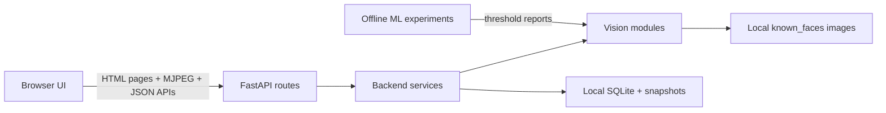
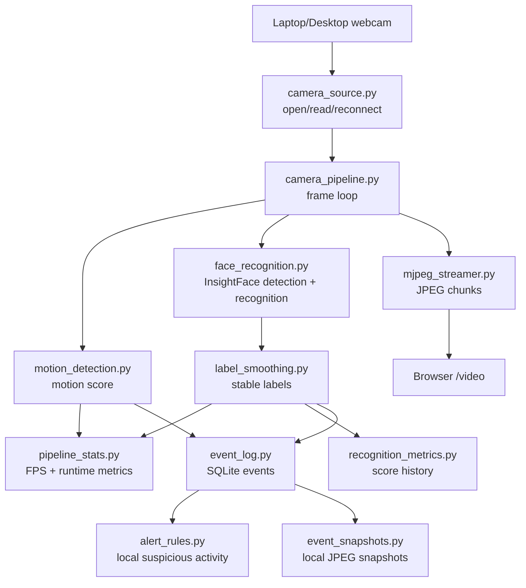
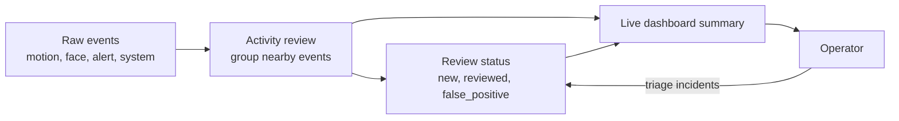
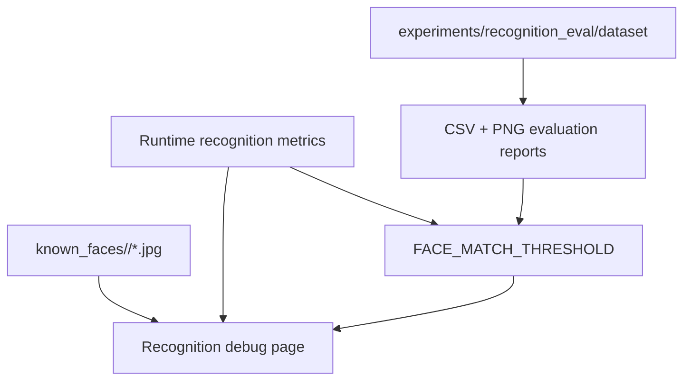

# Architecture Diagram

This page gives a quick visual explanation of the Smart Camera App architecture.
GitHub renders these Mermaid diagrams directly in Markdown.

## System Overview

Key idea:
The app is a local-first FastAPI monolith with clear internal boundaries. Routes
handle HTTP, services coordinate workflows, and vision modules handle ML/computer
vision logic.

## Live Camera Pipeline

Key idea:
Capture and streaming stay separate from heavier analysis. Face recognition can
run at a controlled cadence while the browser still receives an annotated stream.

## Operator Workflow

Key idea:
The raw event log is not the final product experience. The dashboard and review
page turn low-level events into a workflow a person can actually use.

## Debug And ML Feedback Loop

Key idea:
There are two ML quality loops:

- Runtime loop: observe live scores and near-threshold behavior.
- Offline loop: evaluate labeled images before changing thresholds.

## Local Data Boundary

| Data | Location | Git status | Notes |
| --- | --- | --- | --- |
| Known-face photos | `backend/known_faces/` | Ignored | Personal photos stay local. |
| Events | `backend/local_data/events.db` | Ignored | Motion, face, alert, and system events. |
| Review status | `backend/local_data/review_status.db` | Ignored | `new`, `reviewed`, `false_positive`. |
| Recognition metrics | `backend/local_data/recognition_metrics.db` | Ignored | Labels, scores, timestamps; no images or embeddings. |
| Snapshots | `backend/local_data/snapshots/` | Ignored | Local JPEG event snapshots. |
| Experiment results | `experiments/recognition_eval/results/` | Ignored | Local evaluation reports. |

## Interview Summary

One concise way to explain the design:

Smart Camera App is a local-first camera pipeline. It captures frames, runs
motion and face analysis, records local events, converts low-level events into
reviewable incidents, exposes dashboard health metrics, and provides ML tooling
to tune recognition thresholds responsibly.
